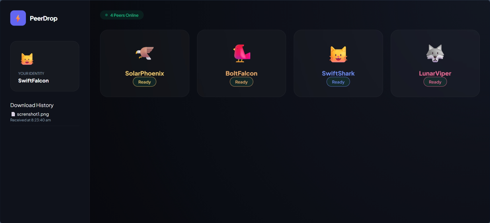
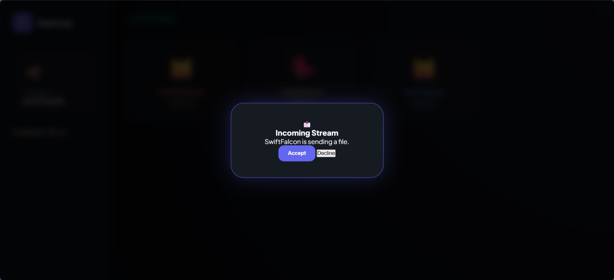
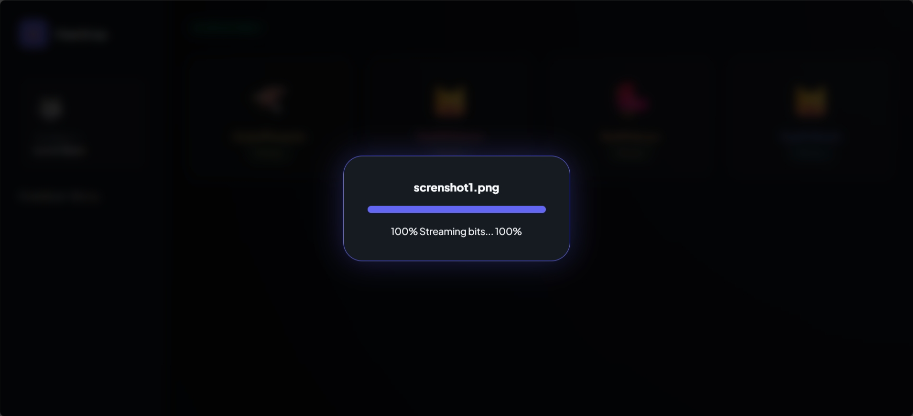

# ⚡ PeerDrop

A modern peer-to-peer (P2P) file sharing application built using **WebRTC** and **WebSockets**. PeerDrop enables users to securely transfer files directly between browsers without relying on centralized file storage.

## 🚀 Features

* Real-time peer discovery
* Secure browser-to-browser file transfer
* WebRTC Data Channel communication
* WebSocket signaling server
* Modern glassmorphism-inspired UI
* Live transfer progress tracking
* Download history
* Random user identities and avatars
* Direct peer-to-peer communication

---

## 🏗️ Tech Stack

**Frontend**

* HTML5
* CSS3
* JavaScript (ES6)

**Backend**

* Node.js
* WebSocket (ws)

**Communication**

* WebRTC
* STUN Server

---

## 📂 Project Structure

```text
PeerDrop/
│
├── app.js
├── index.html
├── signaling-server.js
├── style.css
└── README.md
```

---

## 🔄 How It Works

1. Users join the network through the signaling server.
2. Available peers are displayed in real time.
3. A sender selects a peer and chooses a file.
4. WebRTC establishes a direct peer-to-peer connection.
5. File metadata is exchanged.
6. The file is streamed in chunks through the WebRTC Data Channel.
7. The receiver downloads the file directly in the browser.

---

## 🖼️ Screenshots

### Home Page



---

### Incoming Transfer Request



---

### File Transfer Progress



---


## ⚙️ Installation

### Clone the Repository

```bash
git clone https://github.com/yourusername/PeerDrop.git
cd PeerDrop
```

### Install Dependencies

```bash
npm install ws
```

### Start the Signaling Server

```bash
node signaling-server.js
```

Expected output:

```text
🚀 Signaling Server: ws://localhost:8080
```

### Run the Application

Open `index.html` in your browser.

For better compatibility, use a local server:

```bash
npx http-server
```

or

```bash
python -m http.server 8000
```

---

## 🔒 Security

* Files are transferred directly between peers.
* No file content is stored on the signaling server.
* The signaling server is only used for connection setup.
* Uses Google's public STUN server for NAT traversal.

---

## 🎯 Future Enhancements

* Multiple file transfers
* Drag-and-drop uploads
* End-to-end encryption
* Transfer cancellation
* Mobile optimization
* File previews
* Transfer analytics
* Dark/Light mode toggle

---

## 👨‍💻 Author

**Ashik J**
B.E. Computer Science and Engineering
Anna University Regional Campus, Coimbatore

### Connect with Me

* LinkedIn: https://www.linkedin.com/in/ashik-j55
* GitHub: https://github.com/Ashik-55

---

## ⭐ Support

If you like this project, consider giving it a **Star ⭐** on GitHub.
